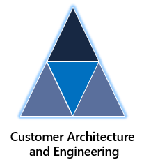

# CAE Bits

This repo has been curated by the CAE (Customer Architecture and Engineering) organization, that are part of Microsoft's CSU (Customer Success Unit).

> The CAE team are the team behind initiatives like:
>
> - [ALZ (Azure Landing Zones)](https://aka.ms/alz)
> - [AVD (Azure Virtual Desktop) Landing Zone Accelerator](https://learn.microsoft.com/azure/cloud-adoption-framework/scenarios/wvd/enterprise-scale-landing-zone)
> - [AVS (Azure VWware Solution) Landing Zone Accelerator](https://learn.microsoft.com/azure/cloud-adoption-framework/scenarios/azure-vmware/enterprise-scale-landing-zone)
> - Plus many more...

The repo contains "bits" (samples, examples, scripts, guides, etc.) from members of the CAE organization that they wish to share with the wider community so everyone can benefit from them.

## Areas

Checkout the below areas for samples, examples, scripts, guides and much more:

- [Azure Infrastructure/Core](infra/README.md)
- More areas coming soon...

## Support

This repo is mainly samples, examples, scripts and other useful "bits" from the CAE organization within Microsoft's Customer Success Unit (CSU) that they want to share with the community to assist them with their cloud journeys.

So these are not officially supported, but please raise an issue and we will do our best to assist and provide assistance if you find a bug or need a question answered about something in this repo 👍

Please see the [`SUPPORT.md`](SUPPORT.md) for more info and also the [`SECURITY.md`](SECURITY.md) for any security related concerns.

## Contributing

This project welcomes contributions and suggestions.  Most contributions require you to agree to a Contributor License Agreement (CLA) declaring that you have the right to, and actually do, grant us the rights to use your contribution. For details, visit [https://cla.opensource.microsoft.com](https://cla.opensource.microsoft.com).

When you submit a pull request, a CLA bot will automatically determine whether you need to provide a CLA and decorate the PR appropriately (e.g., status check, comment). Simply follow the instructions provided by the bot. You will only need to do this once across all repos using our CLA.

This project has adopted the [Microsoft Open Source Code of Conduct](https://opensource.microsoft.com/codeofconduct/). For more information see the [Code of Conduct FAQ](https://opensource.microsoft.com/codeofconduct/faq/) or contact [opencode@microsoft.com](mailto:opencode@microsoft.com) with any additional questions or comments.

## Trademarks

This project may contain trademarks or logos for projects, products, or services. Authorized use of Microsoft trademarks or logos is subject to and must follow [Microsoft's Trademark & Brand Guidelines](https://www.microsoft.com//legal/intellectualproperty/trademarks/usage/general). Use of Microsoft trademarks or logos in modified versions of this project must not cause confusion or imply Microsoft sponsorship. Any use of third-party trademarks or logos are subject to those third-party's policies.
