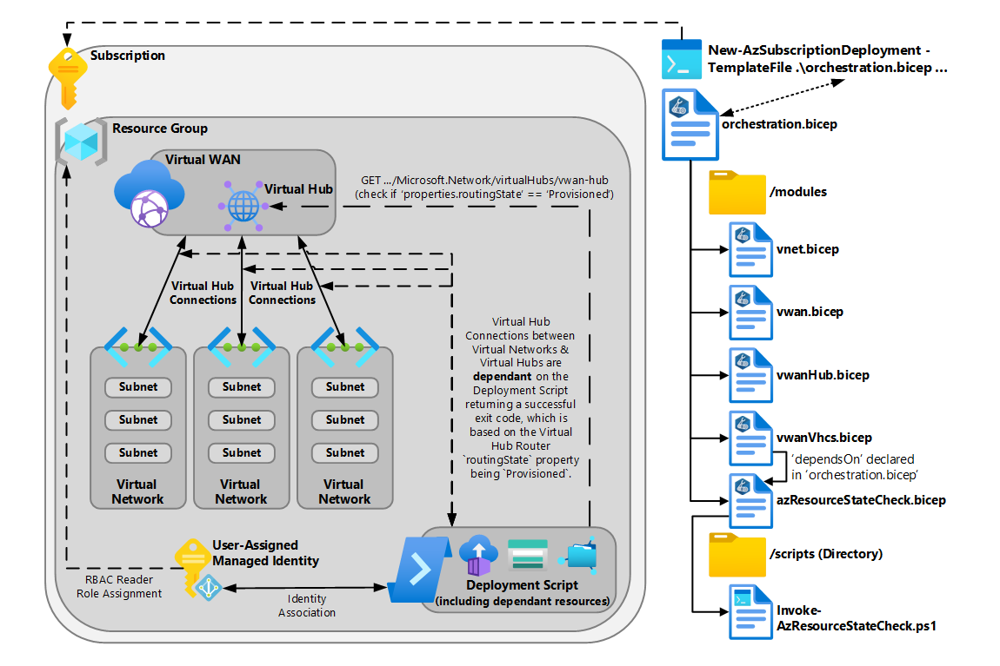
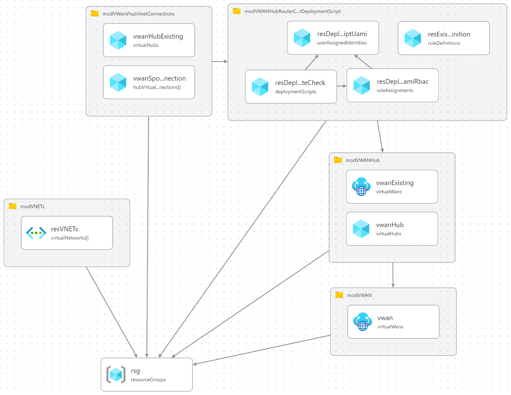

# Sample: Check Resource Property with Deployment Scripts

> 📄 This sample is documented in the Azure Architecture Center here: [Check Resource Property with Deployment Scripts](https://learn.microsoft.com/azure/architecture/guide/devops/deployment-scripts-property-check) 📄

This sample could be used for many scenarios, like the one described below, to help orchestrate a single ARM/Bicep deployment that requires you to await the status of a resource to be in a desired state before progressing with other parts of the deployment.

## Details

This sample deploys the following resources using Bicep:

**Deployment Scope:** Subscription

- 1 x Resource Group
- 1 x Virtual WAN
- 1 x Virtual WAN Hub
  - In the Virtual WAN
- 3 x Virtual Networks
- 1 x Deployment Script
  - This Deployment Script runs the PowerShell script [`Invoke-AzResourceStateCheck.ps1`](scripts/Invoke-AzResourceStateCheck.ps1) which polls the Virtual WAN Hub via a `GET` API call, every `X` seconds for `X` iterations (configurable via parameter input), to check the `routingState` (the status of the Virtual WAN Hub Router) is `Provisioned` (aka Ready).
    - This is the "magic" of this sample as the Virtual WAN Hub itself may be ready but if you were to try to create a Virtual Hub Connection before the Virtual WAN Hub Router is `Provisioned`, which can take around 10 minutes when a Virtual WAN Hub is created, the Virtual Hub Connections will fail as the router isn't ready. And that leaves you with a failed deployment via Bicep and you need to re-run the deployment again, by which time the Virtual WAN Hub Router is now in the `Provisioned State`
- 3 x Virtual WAN Hub Connections
  - Connecting each of the Virtual Networks to the Virtual WAN Hub
  - **This is dependant on the Deployment Script running and returning a successful exit code.**

### Diagram

#### Architectural

> *Download a [Visio file](img/deployment-script-property-check.vsdx) of this architecture.*

#### Bicep Visualizer

### Usage Instructions

#### Pre-Requisites

1. [PowerShell](https://learn.microsoft.com/powershell/scripting/install/installing-powershell)
2. [Azure `Az` PowerShell Modules](https://learn.microsoft.com/powershell/azure/install-az-ps)
3. An Azure Subscription

#### Deployment Instructions

1. Open PowerShell
2. Login to Azure with `Connect-AzAccount`
3. Select the correct Azure Subscription to deploy to with `Select-AzSubscription -SubscriptionId 'xxxxxxxx-xxxx-xxxx-xxxx-xxxxxxxxxxxx`
4. Amend the parameter values in the parameter file [`orchestration.parameters.json`](orchestration.parameters.json) and save the file with any changes
5. Deploy the [`orchestration.bicep`](orchestration.bicep) using the command `New-AzSubscriptionDeployment -TemplateFile .\orchestration.bicep -TemplateParameterFile .\orchestration.parameters.json -Location 'uksouth'`
